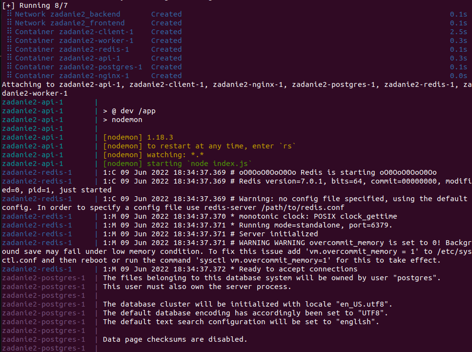
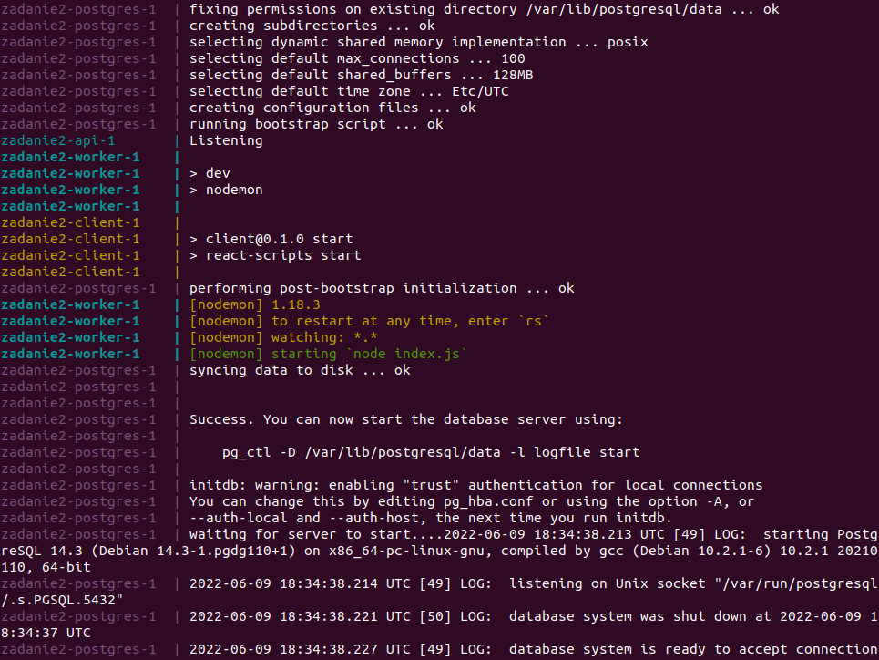
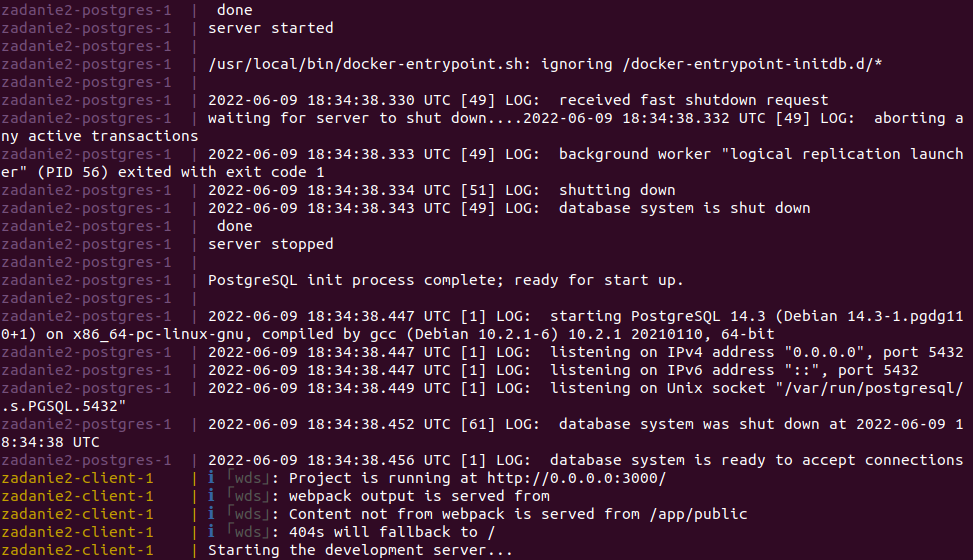
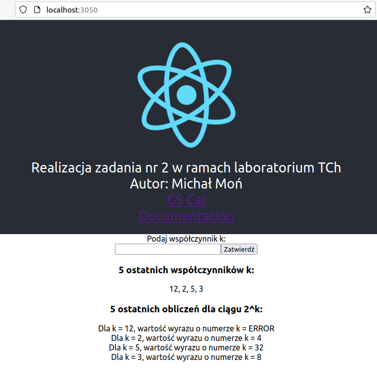

<h1>Technologie Chmurowe - Zadanie 2</h1>
<h2>Autor: Michał Moń</h3>
<h4>Dokumentacja usługi w wersji deweloperskiej:</h4>

Kontekst potrzebny do zbudowania obrazów usługi znajduje się w pliku <b>docker-compose.dev.yml</b>, natomiast do budowania 
  używane są pliki <b>Dockerfile.dev</b> w katalogach poszczególnych elementów aplikacji. Dla zwiększenia elastyczności i przejrzystości 
  zmienne środowiskowe zostały przeniesione do katalogu <b>".config/dev/"</b>.  
  Plik <b>docker-compose.dev.yml</b> definiuje sieci:

<ul>
  <li>frontend</li>
  <li>backend</li>
</ul>

Do sieci <b>frontend</b> podłączony jest serwer <b>nginx</b>, który wystawia port 3050. Wszystkie kontenery są podłączone do sieci <b>backend</b>.

<h4>Użyte polecenie i uruchomienie usługi:</h4>

<b>docker compose -f docker-compose.dev.yml up</b> (wykonane w katalogu z odpowiednim plikiem)

  
  
 
