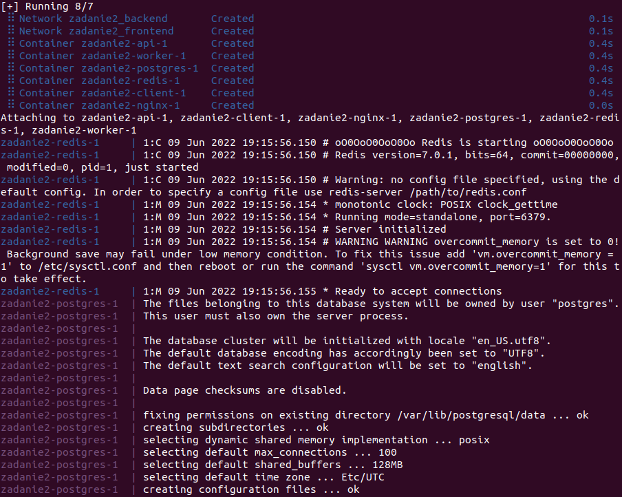
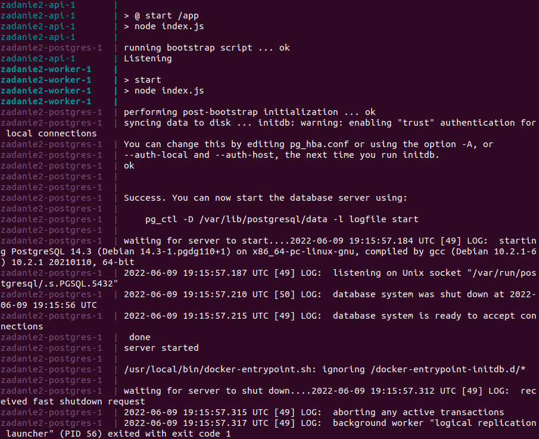
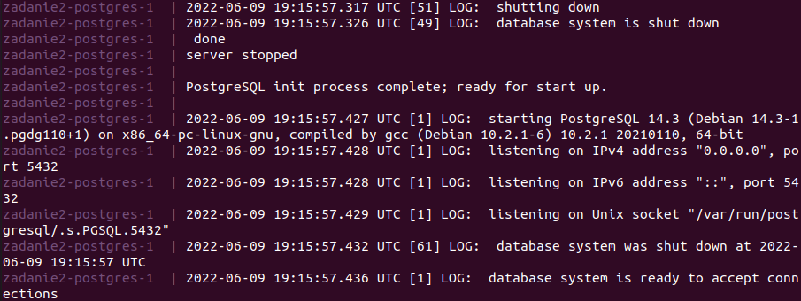
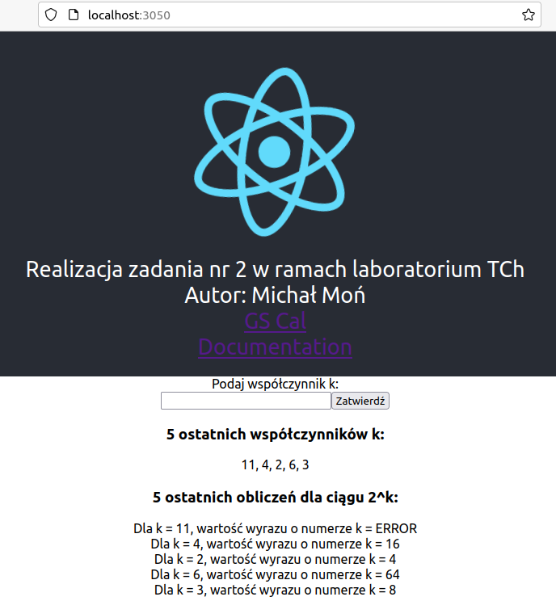

<h1>Technologie Chmurowe - Zadanie 2</h1>
<h2>Autor: Michał Moń</h3>
<h4>Dokumentacja usługi w wersji produkcyjnej:</h4>
<h4>Polecenia użyte do zbudowania obrazów i wypchnięcia ich do repozytorium Dockerhub:</h4>
<b>UWAGA: </b>Każde z poleceń wykonane w katalogu z odpowiednim plikiem <b>Dockerfile</b>. 
<ul>
  <li>docker build -t michalmon/tch-z2:api .</li>
  <li>docker build -t michalmon/tch-z2:client .</li>
  <li>docker build -t michalmon/tch-z2:nginx .</li>
  <li>docker build -t michalmon/tch-z2:worker .</li>
  <li>docker push michalmon/tch-z2:api</li>
  <li>docker push michalmon/tch-z2:client</li>
  <li>docker push michalmon/tch-z2:nginx</li>
  <li>docker push michalmon/tch-z2:worker</li>
</ul>
Link do repozytorium Dockerhub ze zbudowanymi obrazami: <a href="https://hub.docker.com/r/michalmon/tch-z2">Link</a>  

Zbudowanie wyżej wymienionych obrazów oraz wypchnięcie ich do repozytorium Dockerhub było konieczne, ponieważ 
 plik <b>docker-compose.yml</b> bazuje na tych obrazach. Analogiczne do wersji deweloperskiej zmienne środowiskowe
 przechowywane są w oddzielnym katalogu <b>".config/prod/"</b>, natomiast nie mają przypisanych wartości, zatem
 muszą zostać pobrane ze zmiennych Shell. Do ustawienia wartości zmiennych w powłoce został wykorzystany plik
 <b>secrets.sh</b>. Dodatkowo, podobnie jak w wersji deweloperskiej usługi, zostały utworzone sieci <b>frontend</b> oraz
 <b>backend</b>.

 
<h4>Użyte polecenia i uruchomienie usługi w wersji produkcyjnej:<h4>
  
<ul>
  <li><b>. secrets-sh</b></li>
  <li><b>docker compose -f docker-compose.yml up</b></li>
</ul>
  

