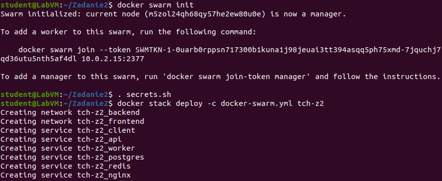
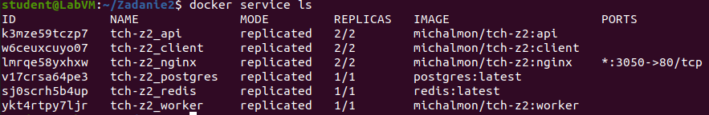
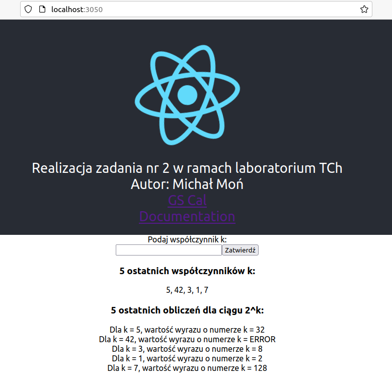

<h1>Technologie Chmurowe - Zadanie 2</h1>
<h2>Autor: Michał Moń</h3>
<h3>Dokumentacja usługi przy uruchomieniu w klastrze Swarm:</h3>

Analogicznie jak przy uruchamianiu usługi w wersji produkcyjnej wartości zmiennych pobierane są z powłoki,
zatem ponownie zostanie wykorzystany plik <b>secrets.sh</b>.

<h4>Konfiguracja poszczególnych elementów usługi:</h4>
<ol>
  <li>
    <h4>postgres:</h4>
    <ul>
      <li>Liczba replik: 1</li>
      <li>Polityka restartu: restart w razie awarii</li>
      <li>Limity zasobów: minimalne: 0.25 CPU, 30M pamięci, maksymalne: 0.5 CPU, 60M pamięci</li>
      <li>Opis: limit zasobów został dość mocno ograniczony, ponieważ w bazie danych została stworzona tylko jedna tabela i operacje na niej nie będą potrzebować dużej ilości zasobów</li>
    </ul>
  </li>
  <li>
    <h4>redis:</h4>
    <ul>
      <li>Liczba replik: 1</li>
      <li>Polityka restartu: restart w razie awarii</li>
      <li>Limity zasobów: minimalne: 0.5 CPU, 50M pamięci, maksymalne: 1 CPU, 100M pamięci</li>
      <li>Opis: W przypadku bazy "redis" potrzebuje ona więcej zasobów niż "postgres", ponieważ przechowuje dane w pamięci operacyjnej</li>
    </ul>
  </li>
  <li>
    <h4>nginx:</h4>
    <ul>
      <li>Liczba replik: 2</li>
      <li>Polityka restartu: restart w razie awarii</li>
      <li>Limity zasobów: minimalne: 0.25 CPU, 10M pamięci, maksymalne: 0.5 CPU, 30M pamięci</li>
      <li>Opis: W przypadku serwera "nginx" liczba replik została ustawiona na 2, ponieważ potencjalnie mógłby być zmuszony do odpowiedzi na dużą liczbę żądań, nie wymaga natomiast zbyt wiele zasobów</li>
    </ul>
  </li>
  <li>
    <h4>client:</h4>
    <ul>
      <li>Liczba replik: 2</li>
      <li>Polityka restartu: restart w razie awarii</li>
      <li>Limity zasobów: minimalne: 0.25 CPU, 20M pamięci, maksymalne: 0.75 CPU, 60M pamięci</li>
      <li>Opis: W przypadku elementu "client" liczba replik została ustawiona na 2, aby utrzymać ciągłość komunikacji z użytkownikiem, natomiast odpowiadanie na jego żądania nie wymaga na ogół zbyt wiele zasóbów, stąd powyższe limity</li>
    </ul>
  </li>
  <li>
    <h4>api:</h4>
    <ul>
      <li>Liczba replik: 2</li>
      <li>Polityka restartu: restart w razie awarii</li>
      <li>Limity zasobów: minimalne: 0.75 CPU, 20M pamięci, maksymalne: 1.5 CPU, 60M pamięci</li>
      <li>Opis: Analogicznie do elementu "client", w przypadku elementu "api" liczba replik została ustawiona na 2, natomiast limit zasobów został nieco zwiększony, ponieważ element "api" odpowiada za pobieranie danych z bazy, ich przetwarzanie oraz odpowiadanie na żądania</li>
    </ul>
  </li>
  <li>
    <h4>worker:</h4>
    <ul>
      <li>Liczba replik: 1</li>
      <li>Polityka restartu: restart w razie awarii</li>
      <li>Limity zasobów: minimalne: 0.5 CPU, 15M pamięci, maksymalne: 1 CPU, 30M pamięci</li>
      <li>Opis: W przypadku elementu "worker" limit zasób jest dość niski, ponieważ wyliczanie ciągu geometrycznego nie wymaga zbyt dużej ilości zasobów (tym bardziej, że istnieje ograniczenie wartości wprowadzonego współczynnika "k")</li>
    </ul>
  </li>
</ol>

<h4>Użyte polecenia i uruchomienie usługi w klastrze Swarm:</h4>

<ul>
  <li><b>docker swarm init</b> - inicjalizacja klastra</li>
  <li><b>. secrets.sh</b> - zapisanie wartości zmiennych środowiskowych w powłoce</li>
  <li><b>docker stack deploy -c docker.swarm.yml tch-z2</b> - wdrożenie usługi w klastrze Swarm</li>
</ul>

